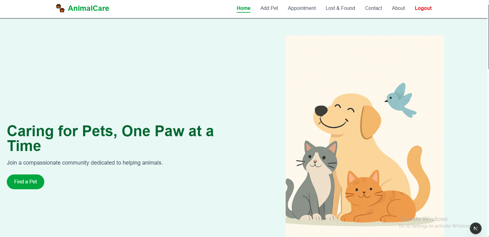
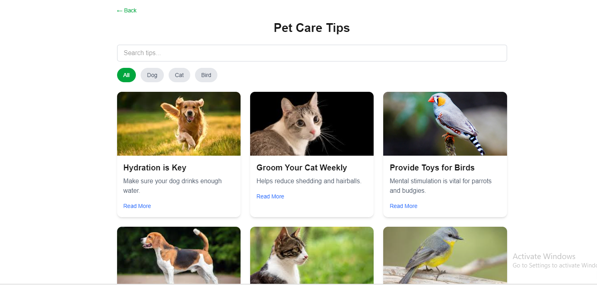
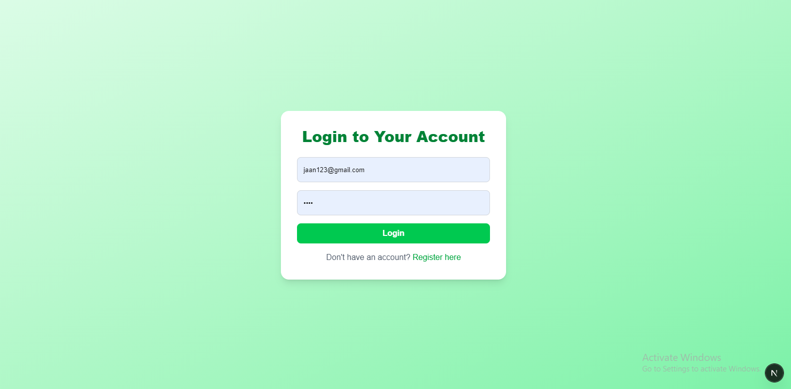
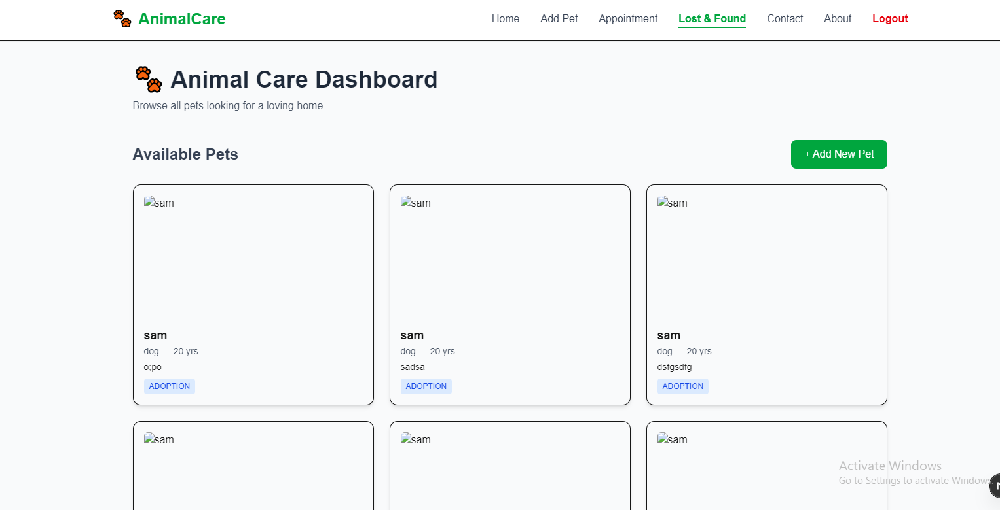
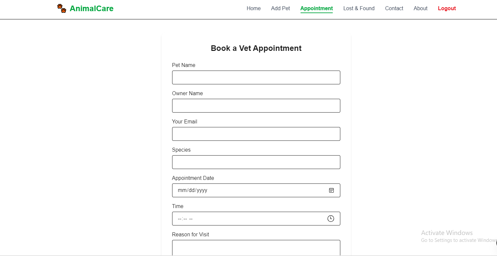

# 🐾 AnimalCare - Fullstack Web App

AnimalCare is a full-stack web application that provides a platform for animal lovers to share, adopt, and take care of pets. The project includes user registration, login, authentication, and protected routes.

## 🛠️ Tech Stack

- **Frontend:** Next.js, Tailwind CSS, TypeScript
- **Backend:** Next.js API routes, Prisma ORM
- **Database:** PostgreSQL or MySQL (via Prisma)
- **Auth:** JWT-based authentication with cookies

## ✨ Features

- ✅ User registration and login
- ✅ Secure password hashing
- ✅ JWT authentication via cookies
- ✅ Protected routes (e.g., Home page only accessible after login)
- ✅ Logout button in Navbar (only visible after login)

- ## 🖼️ Screenshots








---

## 🚀 Getting Started

### 1. Clone the Repository

```bash
git clone https://github.com/yourusername/animalcare.git
cd animalcare
```

### 2. Install Dependencies

```bash
npm install
```

### 3. Set Up Environment Variables

Create a `.env` file:

```env
DATABASE_URL="your_database_url_here"
JWT_SECRET="your_jwt_secret_here"
NEXT_PUBLIC_SUPABASE_URL=https://your-supabase-project.supabase.co
NEXT_PUBLIC_SUPABASE_ANON_KEY=your-anon-public-key-here

EMAIL_USER=youremail@example.com
EMAIL_PASS=your-email-password-or-app-password

DOCTOR_EMAIL=doctor@example.com

```

### 4. Prisma Setup

```bash
npx prisma generate
npx prisma migrate dev --name init
```

### 5. Run the Development Server

```bash
npm run dev
```

Visit `http://localhost:3000` to view the app.

## 📜 License

This project is licensed under the MIT License.
